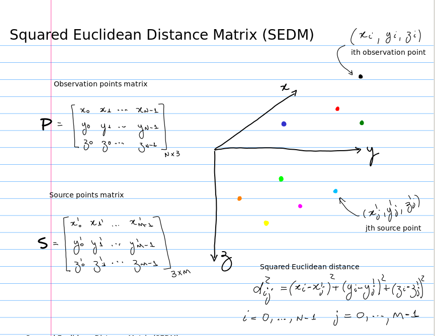

# Gravitational and magnetic fields produced by point sources

This repository contains algorithms commonly used in Geophysics (potential-field methods) for computing gravitational 
and magnetic fields produced by point sources (point masses and dipoles).

    

